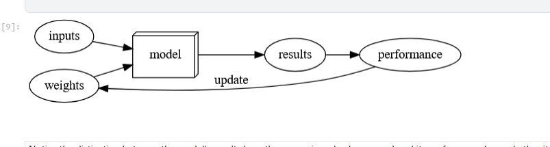
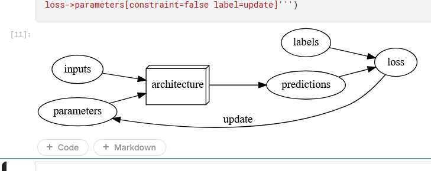
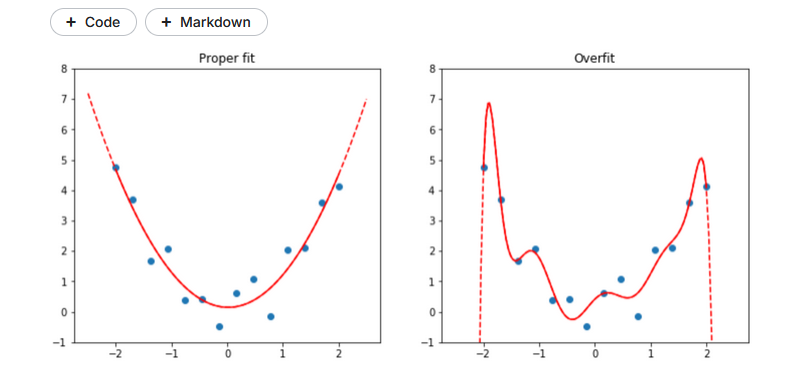
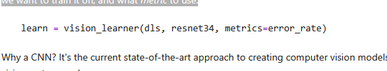
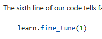
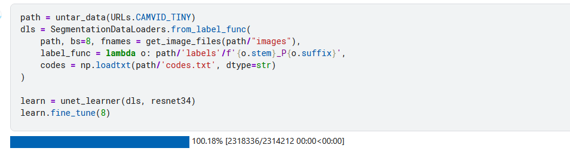
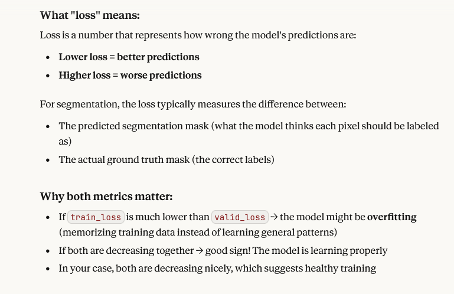
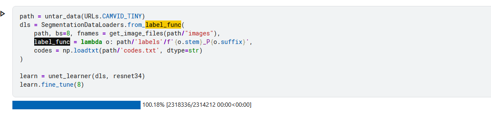
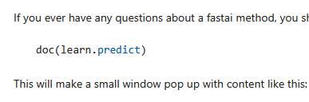

- 1943 Warren McCulloch, a neurophysiologist, and Walter Pitts, a
   logician, teamed up to develop a mathematical model of an artificial 
  neuron. In their [paper](https://www.google.com/url?q=https%3A%2F%2Flink.springer.com%2Farticle%2F10.1007%2FBF02478259) "A Logical Calculus of the Ideas Immanent in Nervous Activity" they declared that:
  
  > : Because of the “all-or-none” character of nervous activity, neural 
  > events and the relations among them can be treated by means of 
  > propositional logic. It is found that the behavior of every net can be 
  > described in these terms.

- 

- *Parallel Distributed Processing* (PDP) by David Rumelhart, James McClellan, and the PDP Research Group, released in 1986

- In fact, the approach laid out in PDP is very similar to the 
  approach used in today's neural networks. The book defined parallel 
  distributed processing as requiring:
  
  1. A set of *processing units*
  2. A *state of activation*
  3. An *output function* for each unit
  4. A *pattern of connectivity* among units
  5. A *propagation rule* for propagating patterns of activities through the network of connectivities
  6. An *activation rule* for combining the inputs impinging on a unit with the current state of that unit to produce an output for the unit
  7. A *learning rule* whereby patterns of connectivity are modified by experience
  8. An *environment* within which the system must operate
     . PyTorch best library for machine learning
     . 
  
  

- saving notebook in collection

### What Is Machine Learning?

- 

- A mathematical proof called the *universal approximation theorem* shows that this function can solve any problem to any level of 
  accuracy, in theory. The fact that neural networks are so flexible means
   that, in practice, they are often a suitable kind of model, and you can
   focus your effort on the process of training them—that is, of finding 
  good weight assignments.

- need to find a new "mechanism" for automatically updating weights for
   every problem. This would be laborious. What we'd like here as well is a
   completely general way to update the weights of a neural network, to 
  make it improve at any given task. Conveniently, this also exists!
  
  This is called *stochastic gradient descent* (SGD). We'll see 
  how neural networks and SGD work in detail in <>, as well as 
  explaining the universal approximation theorem. For now, however, we 
  will instead use Samuel's own words: *We need not go into the details
   of such a procedure to see that it could be made entirely automatic and
   to see that a machine so programmed would "learn" from its experience.*

- The functional form of the *model* is called its *architecture* (but be careful—sometimes people use *model* as a synonym of *architecture*, so this can get confusing).

- The *weights* are called *parameters*.

- The *predictions* are calculated from the *independent variable*, which is the *data* not including the *labels*.

- The *results* of the model are called *predictions*.

- The measure of *performance* is called the *loss*.

- The loss depends not only on the predictions, but also the correct *labels* (also known as *targets* or the *dependent variable*); e.g., "dog" or "cat."

- 

### Limitations of machine learning

- A model cannot be created without data.
- A model can only learn to operate on the patterns seen in the input data used to train it.
- This learning approach only creates *predictions*, not recommended *actions*.
- It's not enough to just have examples of input data; we need *labels* for that data too (e.g., pictures of dogs and cats aren't enough to 
  train a model; we need a label for each one, saying which ones are dogs,
   and which are cats).

Another critical insight comes from considering how a model interacts with its environment. This can create *feedback loops*, as described here:

- A *predictive policing* model is created based on where 
  arrests have been made in the past. In practice, this is not actually 
  predicting crime, but rather predicting arrests, and is therefore 
  partially simply reflecting biases in existing policing processes.
- Law enforcement officers then might use that model to decide where 
  to focus their police activity, resulting in increased arrests in those 
  areas.
- Data on these additional arrests would then be fed back in to retrain future versions of the model.

This is a *positive feedback loop*, where the more the model is used, the more biased the data becomes, making the model even more biased, and so forth.

#### classification vs regression

Note: Classification and Regression: *classification* and *regression* have very specific meanings in machine learning. These are the two main
 types of model that we will be investigating in this book. A 
classification model is one which attempts to predict a class, or 
category. That is, it's predicting from a number of discrete 
possibilities, such as "dog" or "cat." A regression model is one which 
attempts to predict one or more numeric quantities, such as a 
temperature or a location. Sometimes people use the word *regression* to refer to a particular kind of model called a *linear regression model*; this is a bad practice, and we won't be using that terminology in this book!

Even when your model has not fully memorized all your data, earlier on 
in training it may have memorized certain parts of it. As a result, the 
longer you train for, the better your accuracy will get on the training 
set; the validation set accuracy will also improve for a while, but 
eventually it will start getting worse as the model starts to memorize 
the training set, rather than finding generalizable underlying patterns 
in the data. When this happens, we say that the model is *overfitting*.



#### overfitting

**Overfitting is the single most important and challenging issue** when training for all machine learning practitioners, and all 
algorithms. As you will see, it is very easy to create a model that does
 a great job at making predictions on the exact data it has been trained
 on, but it is much harder to make accurate predictions on data the 
model has never seen before. And of course, this is the data that will 
actually matter in practice.

important: Validation Set: When you train a model, you must *always* have both a training set and a validation set, and must measure the 
accuracy of your model only on the validation set. If you train for too 
long, with not enough data, you will see the accuracy of your model 
start to get worse; this is called *overfitting*. fastai defaults `valid_pct` to `0.2`, so even if you forget, fastai will create a validation set for you!

*convolutional neural network* (CNN) and specifies what *architecture* to use (i.e. what kind of model to create), what data we want to train it on, and what *metric* to use:



#### metric

What is a metric? A *metric* is a function that measures the 
quality of the model's predictions using the validation set, and will be
 printed at the end of each *epoch*. In this case, we're using `error_rate`,
 which is a function provided by fastai that does just what it says: 
tells you what percentage of images in the validation set are being 
classified incorrectly. Another common metric for classification is `accuracy` (which is just `1.0 - error_rate`). fastai provides many more, which will be discussed throughout this book.

entire purpose of loss is to define a "measure of performance" that the
 training system can use to update weights automatically. In other 
words, a good choice for loss is a choice that is easy for stochastic 
gradient descent to use. But a metric is defined for human consumption, 
so a good metric is one that is easy for you to understand, and that 
hews as closely as possible to what you want the model to do. At times, 
you might decide that the loss function is a suitable metric, but that 
is not necessarily the case.

#### vision learner

`vision_learner` also has a parameter `pretrained`, which defaults to `True` (so it's used in this case, even though we haven't specified it), which
 sets the weights in your model to values that have already been trained
 by experts to recognize a thousand different categories across 1.3 
million photos (using the famous [*ImageNet* dataset](http://www.image-net.org/)). A model that has weights that have already been trained on some other dataset is called a *pretrained model*.
 You should nearly always use a pretrained model, because it means that 
your model, before you've even shown it any of your data, is already 
very capable.

##### transfer learning

Using a pretrained model for a task different to what it was originally trained for is known as *transfer learning*.
 Unfortunately, because transfer learning is so under-studied, few 
domains have pretrained models available. For instance, there are 
currently few pretrained models available in medicine, making transfer 
learning challenging to use in that domain. In addition, it is not yet 
well understood how to use transfer learning for tasks such as time 
series analysis.

#### fine_tine

How to fit the model



But why is the method called `fine_tune`, and not `fit`? fastai actually *does* have a method called `fit`,
 which does indeed fit a model (i.e. look at images in the training set 
multiple times, each time updating the parameters to make the 
predictions closer and closer to the target labels). But in this case, 
we've started with a pretrained model, and we don't want to throw away 
all those capabilities that it already has. As you'll learn in this 
book, there are some important tricks to adapt a pretrained model for a 
new dataset—a process called *fine-tuning*.

### epoch

But why is the method called `fine_tune`, and not `fit`? fastai actually *does* have a method called `fit`,
 which does indeed fit a model (i.e. look at images in the training set 
multiple times, each time updating the parameters to make the 
predictions closer and closer to the target labels). But in this case, 
we've started with a pretrained model, and we don't want to throw away 
all those capabilities that it already has. As you'll learn in this 
book, there are some important tricks to adapt a pretrained model for a 
new dataset—a process called *fine-tuning*.

```asciidoc
[[dljargon]]
.Deep learning vocabulary
[options="header"]
|=====
| Term | Meaning
|Label | The data that we're trying to predict, such as "dog" or "cat"
|Architecture | The _template_ of the model that we're trying to fit; the actual mathematical function that we're passing the input data and parameters to
|Model | The combination of the architecture with a particular set of parameters
|Parameters | The values in the model that change what task it can do, and are updated through model training
|Fit | Update the parameters of the model such that the predictions of the model using the input data match the target labels
|Train | A synonym for _fit_
|Pretrained model | A model that has already been trained, generally using a large dataset, and will be fine-tuned
|Fine-tune | Update a pretrained model for a different task
|Epoch | One complete pass through the input data
|Loss | A measure of how good the model is, chosen to drive training via SGD
|Metric | A measurement of how good the model is, using the validation set, chosen for human consumption
|Validation set | A set of data held out from training, used only for measuring how good the model is
|Training set | The data used for fitting the model; does not include any data from the validation set
|Overfitting | Training a model in such a way that it _remembers_ specific features of the input data, rather than generalizing well to data not seen during training
|CNN | Convolutional neural network; a type of neural network that works particularly well for computer vision tasks
|=====
```

Creating a model that can recognize the content of every individual pixel in an image is called _segmentation_. Here is how we can train a segmentation model with fastai, using a subset of the [_Camvid_ dataset](http://www0.cs.ucl.ac.uk/staff/G.Brostow/papers/Brostow_2009-PRL.pdf) from the paper "Semantic Object Classes in Video: A High-Definition Ground Truth Database" by Gabruel J. Brostow, Julien Fauqueur, and Roberto Cipolla:

 

### train vs valid loss



### ### Samantic Object Classes in Video



Explained:

I'll break down each part of this code for you:

## Data Loading Setup

```python
path = untar_data(URLs.CAMVID_TINY)
```

Downloads and extracts the CamVid Tiny dataset (a small segmentation dataset with street scene images) to a local directory.

```python
dls = SegmentationDataLoaders.from_label_func(
```

Creates DataLoaders specifically designed for image segmentation tasks.

## DataLoader Parameters

```python
path, bs=8, fnames = get_image_files(path/"images"),
```

- `path`: Base directory for the data
- `bs=8`: Batch size of 8 images
- `fnames`: Gets all image files from the "images" subdirectory

```python
label_func = lambda o: path/'labels'/f'{o.stem}_P{o.suffix}',
```

Defines how to find the corresponding label/mask for each image. For an image named "abc.jpg", it looks for "abc_P.jpg" in the labels folder. The stem is the filename without extension, and suffix is the file extension.

```python
codes = np.loadtxt(path/'codes.txt', dtype=str)
```

Loads the class names (like "road", "car", "sky") from a text file that maps segmentation mask values to human-readable labels.

## Model Training

```python
learn = unet_learner(dls, resnet34)
```

Creates a U-Net model for segmentation using ResNet34 as the encoder backbone. U-Net is a popular architecture for semantic segmentation.

```python
learn.fine_tune(8)
```

Trains the model for 8 epochs using transfer learning - first unfreezing and training the pretrained layers, then fine-tuning the entire network.

## Training Output

The progress bars and tables show the training progress with loss metrics and timing for each epoch, including validation performance.

Good question! These are attributes of Python's `pathlib.Path` object:

## `o.stem`

The filename **without** the extension.

Example:

- If `o = Path("image_001.jpg")`
- `o.stem` → `"image_001"`

## `o.suffix`

The file extension **including the dot**.

Example:

- If `o = Path("image_001.jpg")`
- `o.suffix` → `".jpg"`

## In the code context:

```python
label_func = lambda o: path/'labels'/f'{o.stem}_P{o.suffix}'
```

If the input image is `"street_scene.png"`:

- `o.stem` = `"street_scene"`
- `o.suffix` = `".png"`
- Result: `path/'labels'/'street_scene_P.png'`

This naming convention (`_P` suffix) is specific to the CamVid dataset, where label masks have the same name as their corresponding images but with `_P` appended before the extension.

## Other useful Path attributes:

- `o.name` → full filename (`"image_001.jpg"`)
- `o.parent` → directory containing the file
- `o.parts` → tuple of all path components

### modeling natural language processing sentiment (IMDb)

I'll break down this text classification code:

## Import Statement

```python
from fastai.text.all import *
```

Imports all text-related functions and classes from fastai's text module.

## Creating DataLoaders

```python
dls = TextDataLoaders.from_folder(untar_data(URLs.IMDB), valid='test')
```

- `untar_data(URLs.IMDB)`: Downloads and extracts the IMDB movie review dataset
- `TextDataLoaders.from_folder()`: Creates DataLoaders from a folder structure
- `valid='test'`: Uses the folder named "test" as the validation set (IMDB dataset has separate train/test folders)

The IMDB dataset contains movie reviews labeled as positive or negative sentiment.

## Creating the Learner

```python
learn = text_classifier_learner(dls, AWD_LSTM, drop_mult=0.5, metrics=accuracy)
```

- `text_classifier_learner()`: Creates a text classification model
- `dls`: The DataLoaders created above
- `AWD_LSTM`: **A**WD (ASGD Weight-Dropped) **LSTM** - a specific type of recurrent neural network architecture good for text
- `drop_mult=0.5`: Dropout multiplier set to 0.5 (reduces overfitting by randomly dropping 50% of connections during training)
- `metrics=accuracy`: Track accuracy as the evaluation metric (% of correct predictions)

## Training

```python
learn.fine_tune(4, 1e-2)
```

- `4`: Train for 4 epochs
- `1e-2`: Learning rate of 0.01 (controls how big the weight updates are during training)

This uses transfer learning - the model starts with pretrained language understanding and fine-tunes it for sentiment classification.


### doc



### hyperparameters

e. This is because in realistic scenarios we rarely build a model just 
by training its weight parameters once. Instead, we are likely to 
explore many versions of a model through various modeling choices 
regarding network architecture, learning rates, data augmentation 
strategies, and other factors we will discuss in upcoming chapters. Many
 of these choices can be described as choices of *hyperparameters*.
 The word reflects that they are parameters about parameters, since they
 are the higher-level choices that govern the meaning of the weight 
parameters.
