[Practical Deep Learning for Coders - 1: Getting started](https://course.fast.ai/Lessons/lesson1.html)

Is it a bird notebook

https://www.kaggle.com/code/jhoward/is-it-a-bird-creating-a-model-from-your-own-data

### DataBlock

- gives fastai all information it needs for computer vision model

- 

- easy to check because can look at it

- dataloader: pytorch iterates through to grab data at a time; feed the training algorithm with all images (batch) at once

- dls.show_batch: show me example of a batch of data passing into model

- no progress bar!!!!!

- docs.fast.ai

- 

- 

- a *learner* is something that combines a model (neural network function to train) and data to train it with; nn function is the model (resnet18)

- timm.fast.ai has largest collection of image models
  
  - documentation:
  
  - 

- resnet should be fine for what you'd like to do
  
  - already trained this model to recognize 1 million images and 1000 different types and made weight available

- *fine_tune* takes pre-trained rates and adjusts to teach model differences between dataset and what it was originally trained for

### Book

[GitHub - fastai/fastbook: The fastai book, published as Jupyter Notebooks](https://github.com/fastai/fastbook)

repo for all the notebooks

view notebook readonly

https://nbviewer.org/

Last url:
[Practical Deep Learning for Coders - 1: Getting started](https://course.fast.ai/Lessons/lesson1.html)

Will be using PyTorch

TensorFlow is dying

Fastai is built ontop of PyTorch

Going to be using Kaggle https://www.kaggle.com/work/code

### Segmentation

- color every pixel according to what it is
  
  - 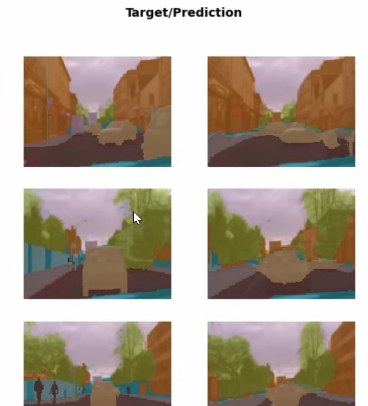

- left was manually plugged in and right is predicted

- 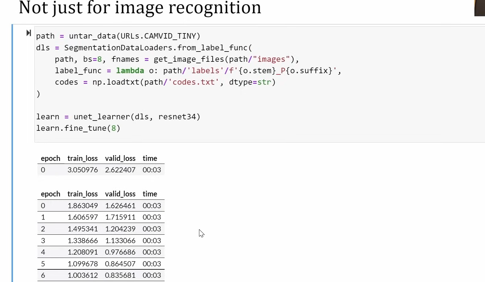

- DataBlocks are intermediate flexible

- SegmentationDataLoaders

### Tabular

- 

- 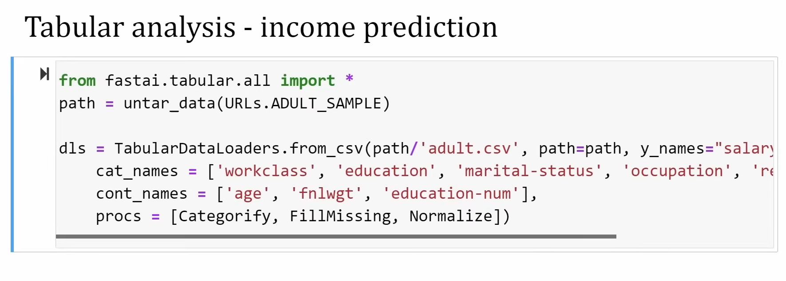

- URLs.ADULT_SAMPLE -- based on research

- 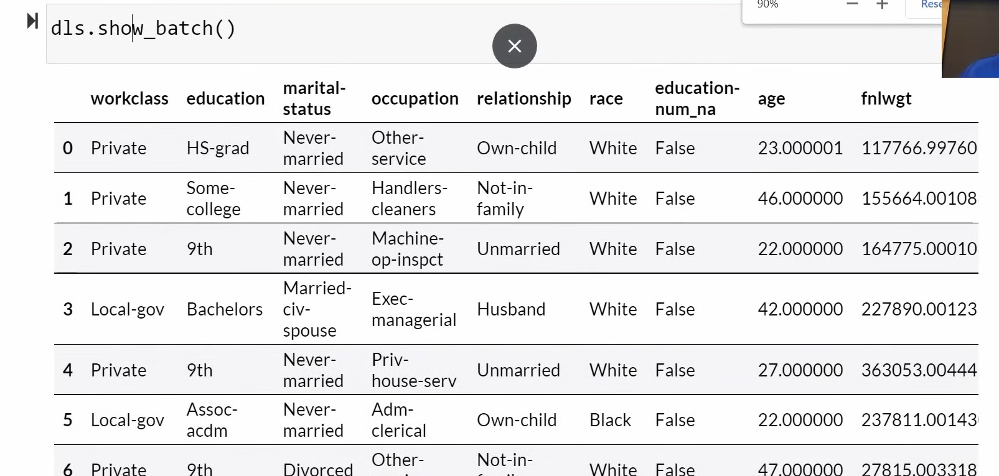

- 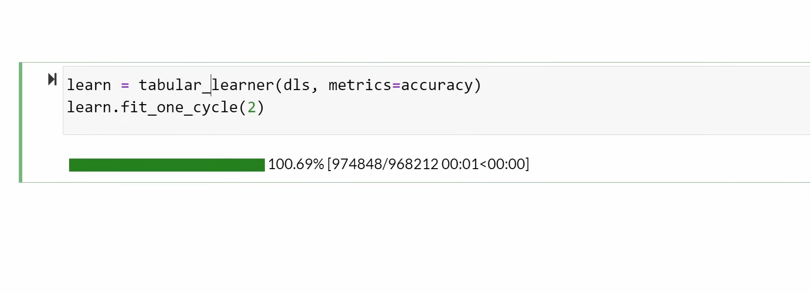

- fit_one_cycle -- no pre-trained model for what we want

### Collaborative filtering

- 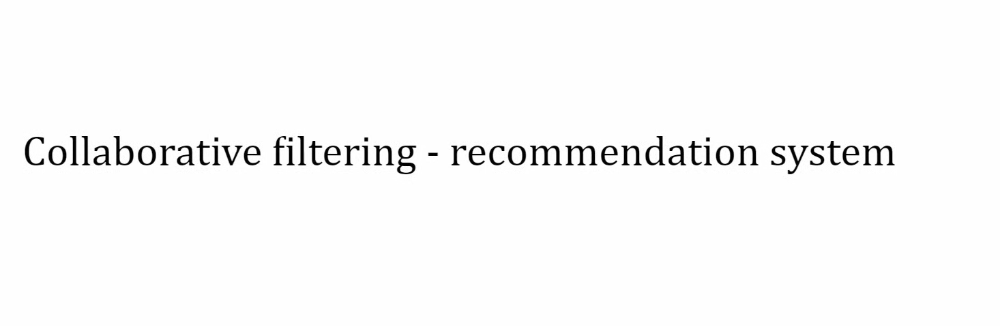

- basis for recommendations systems

- take dataset to say which users used some products; used to guess what other products users might like by looking at similar users
  
  - not demographics, but people who like the same products
  
  - i.e. if you used Spotify, music genre, etc. it'll play similar music

- 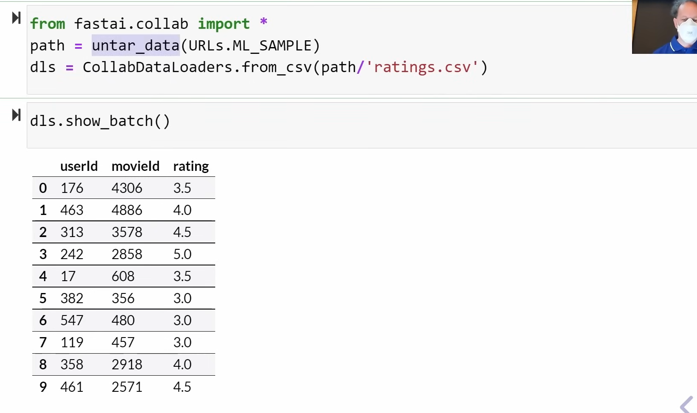

- 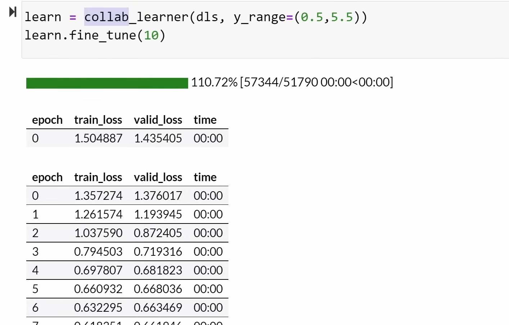

- 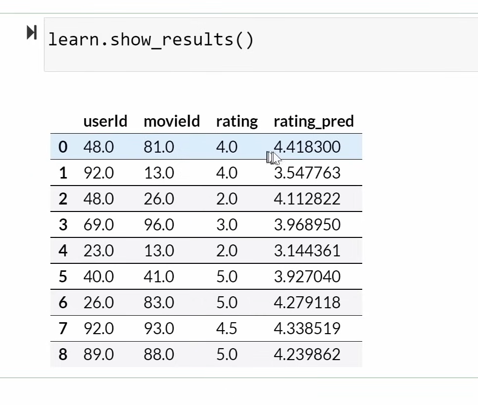

- TURN NOTEBOOK INTO PRESENTATION SLIDES: rise.readthedocs.io

- 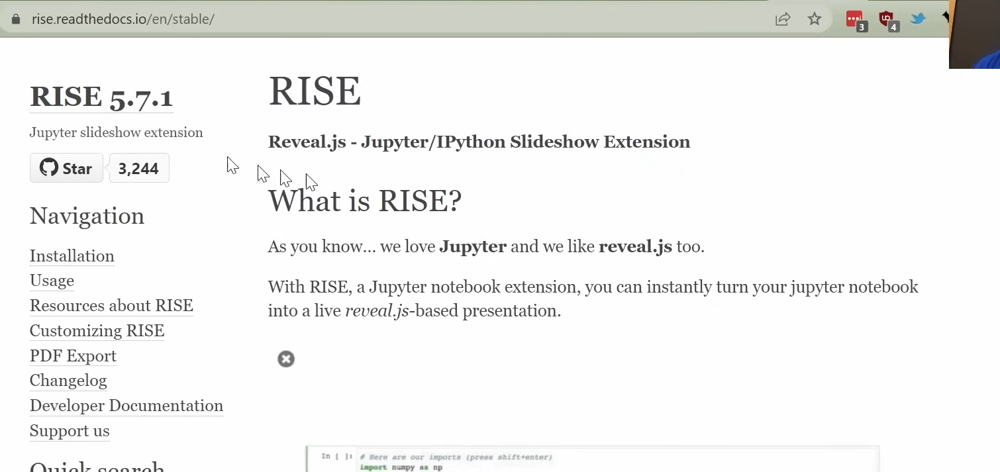

### What can deep learning do?

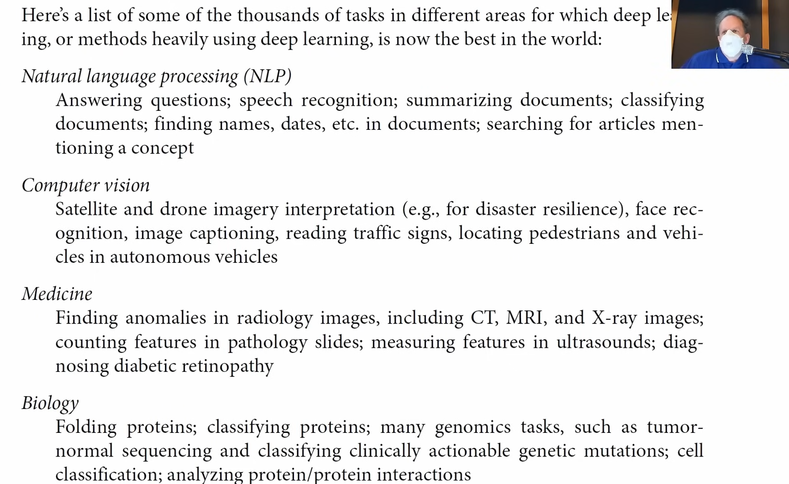

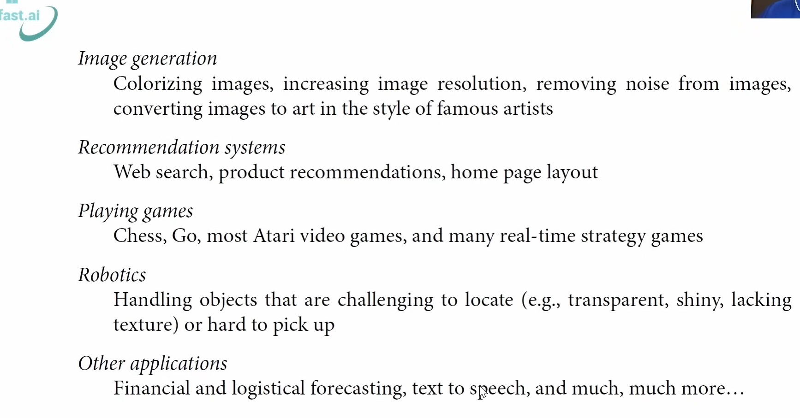

### What's going on?

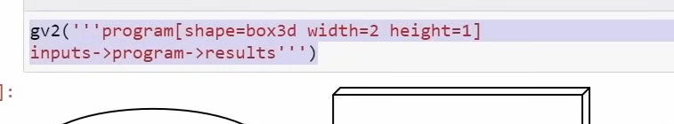

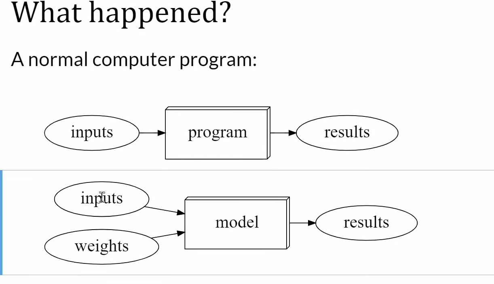

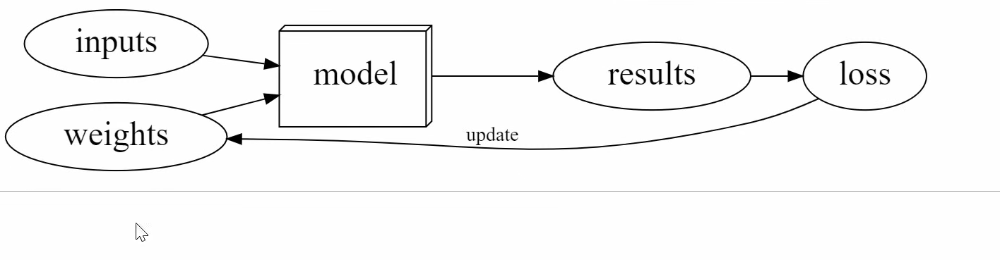

- A “machine learning model”  doesn't look that different…
  but… The program has been replaced with something  called “a model,” and we don't just have inputs  
  Machine learning models at a high level
  now, we now also have weights, which are also  called “parameters,” and the key thing is this:  
  the model is not any more a bunch of  conditionals, and loops, and things.
  It's a mathematical function. In the case of a neural network, it's a  mathematical function that takes the inputs,  
  multiplies them together by the weights –  by one set of weights – and adds them up;   and then it does that again for a  second set of weights and adds them up,  
  does it again for a third set of  weights, and adds them up and so forth. It then takes all the negative  numbers, and replaces them with zeros,  
  and then it takes those as inputs to  the next layer. It does the same thing;   multiplies them a bunch of times, and adds  them up, and it does that a few times,  
  and that's called “a neural  network.” Now, the model  
  therefore, is not going to do anything useful,  unless these weights are very carefully chosen.
  And, so the way it works is, that we actually  start out with these weights as being   random. So initially, this thing  doesn't do anything useful at all!
  So, what we do –- the way arthur samuel  described it back in the late 50s   (the inventor of machine learning) – is,  he said: “okay, let's take the inputs,  
  and the weights, put them through our  model.” He wasn't talking particularly   about neural networks. He's just  like… whatever model you like…
  get the results, and then let's decide how  “good” they are, right? So, if for example,  
  we're trying to decide: “is this a picture of  a bird?” and the model said – which initially  
  is random – says “this isn't a bird,” and actually  it IS a bird, we would say: “oh you're wrong!” So  
  we then calculate “the loss.” So, the loss is  a number that says how good were the results.
  So that's all pretty straightforward, you  know. We could, for example, say oh what's   the accuracy? We could look at 100 photos and  say which percentage of them did it get right.  
  No worries. Now the critical step is this  arrow. We need a way of updating the weights  
  that is coming up with a new set of weights  that are a bit better than the previous set.  
  Okay. And by a bit better we  mean it should make the loss  
  get a little bit better. So we've got this  number that says how good is our model and  
  initially it's terrible, right? It's random. We  need some mechanism of making a little bit better.
  If we can just do that one thing   then we just need to iterate this a few times.  Because each time we put in some more inputs  
  and... and put in our weights and get our loss  and use it to make it a little bit better,  
  then if we make it a little bit better enough  times, eventually it's going to get good.  
  Assuming that our model is flexible enough to  represent the thing we want to do. Now remember  

- need to create:
  
  - 
  
  - with enough time and data!

- once completed, we get this:
  
  - 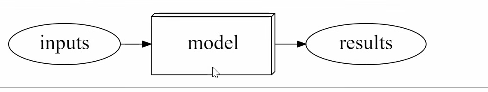
