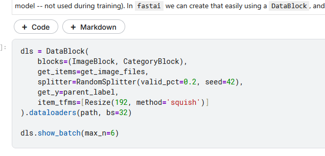
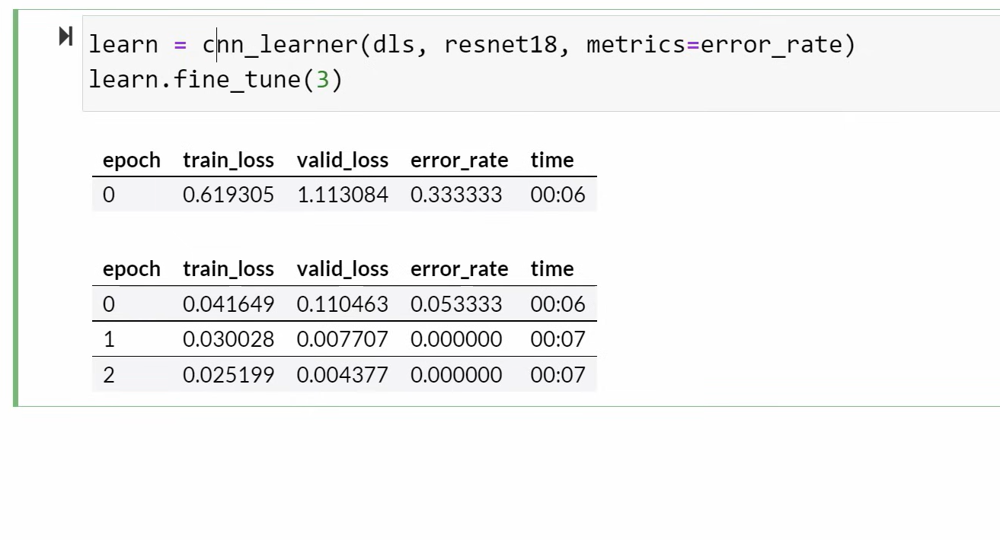
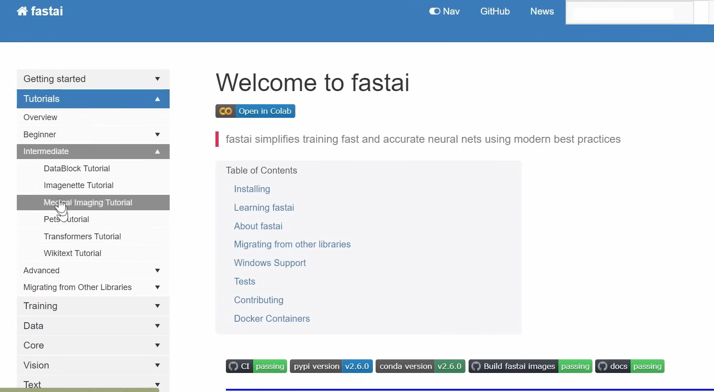
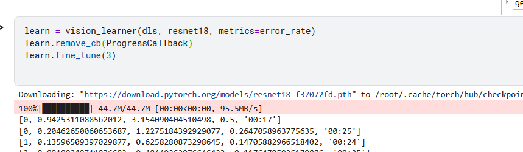
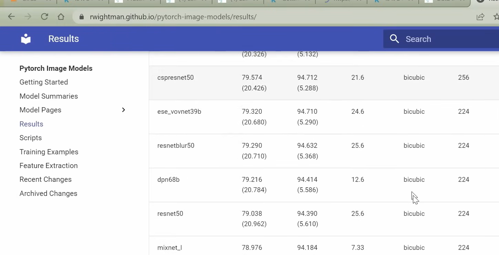
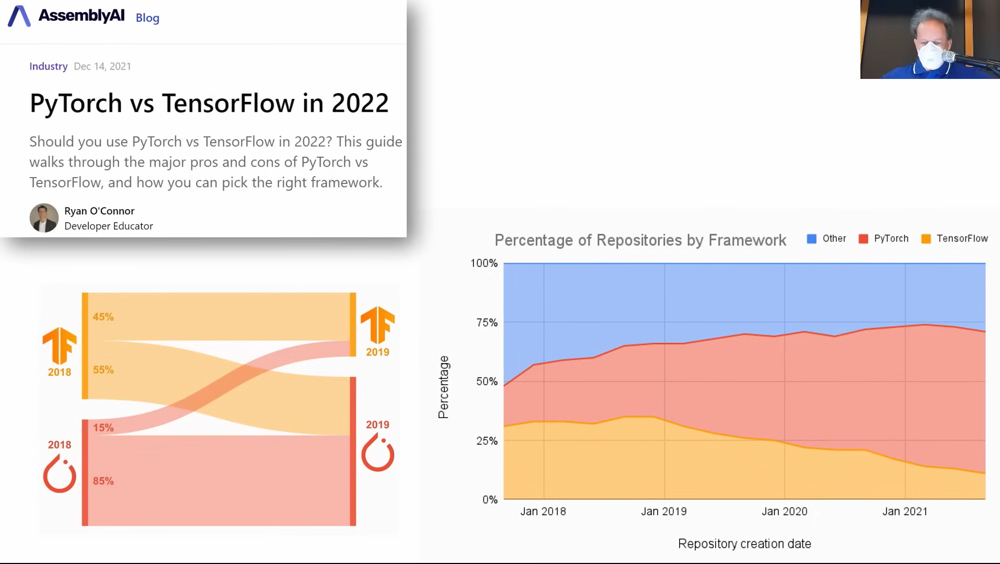

[Practical Deep Learning for Coders - 1: Getting started](https://course.fast.ai/Lessons/lesson1.html)

Is it a bird notebook

https://www.kaggle.com/code/jhoward/is-it-a-bird-creating-a-model-from-your-own-data

### DataBlock

- gives fastai all information it needs for computer vision model

- 

- easy to check because can look at it

- dataloader: pytorch iterates through to grab data at a time; feed the training algorithm with all images (batch) at once

- dls.show_batch: show me example of a batch of data passing into model

- no progress bar!!!!!

- docs.fast.ai

- 

- 

- a *learner* is something that combines a model (neural network function to train) and data to train it with; nn function is the model (resnet18)

- timm.fast.ai has largest collection of image models
  
  - documentation:
  
  - 

- resnet should be fine for what you'd like to do
  
  - already trained this model to recognize 1 million images and 1000 different types and made weight available

- *fine_tune* takes pre-trained rates and adjusts to teach model differences between dataset and what it was originally trained for

### Book

Last url:
[Practical Deep Learning for Coders - 1: Getting started](https://course.fast.ai/Lessons/lesson1.html)

Will be using PyTorch

TensorFlow is dying

Fastai is built ontop of PyTorch

Going to be using Kaggle https://www.kaggle.com/work/code

